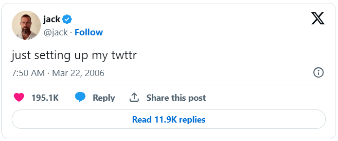

[Home](../README.md) | [Lecture 2](2-Loops.md) | [Problem 2.1](PROBLEM2.1.md) | [Problem 2.2](PROBLEM2.2.md) | Problem 2.3 | [Problem 2.4](PROBLEM2.4.md) | [Problem 2.5](PROBLEM2.5.md)

# Just setting up my twttr

When texting or tweeting, it’s not uncommon to shorten words to save time or space, as by omitting vowels, much like Twitter was originally called twttr. In a file called `twttr.py`, implement a program that prompts the user for a `str` of text and then outputs that same text but with all vowels (A, E, I, O, and U) omitted, whether inputted in uppercase or lowercase.

## Hints
- Recall that a `str` comes with quite a few methods, per [docs.python.org/3/library/stdtypes.html#string-methods](https://docs.python.org/3/library/stdtypes.html#string-methods).
- Much like a `list`, a `str` is “iterable,” which means you can iterate over each of its characters in a loop. For instance, if `s` is a `str`, you could print each of its characters, one at a time, with code like:

		for c in s:
			print(c, end="")

## Before You Begin
From the root of your repository execute `cd 2-Loops` So your current working directory is ...		

		/2-Loops $:
Next execute

		mkdir twttr
to make a folder called `twttr` in your codespace.

Then execute

		cd twttr
to change directories into that folder. You should now see your terminal prompt as `/2-Loops/twttr $`. You can now execute

		code twttr.py
to make a file called `twttr.py` where you’ll write your program.

# How to Test
Here’s how to test your code manually:

1. Run your program with `python twttr.py`. Type `Twitter` and press Enter. Your program should output:

		Twttr   
2. Run your program with `python twttr.py`. Type `What's your name?` and press Enter. Your program should output:

		Wht's yr nm?
3. Run your program with `python twttr.py`. Type `CS50` and press Enter. Your program should output:

		CS50

# Commit your program to GITHUB
At the `/2-Loops/twttr $` prompt in your terminal:

		git add -A 
Add all changed files in the repository to be committed

		git commit -m “Upload completed twttr.py“
Commit all changes in the REPO with the comment “Upload completed twttr.py“
*note: If the file is not complete, adjust the comment to describes what is being commited*

		git push 
Push all changes to the REPO
